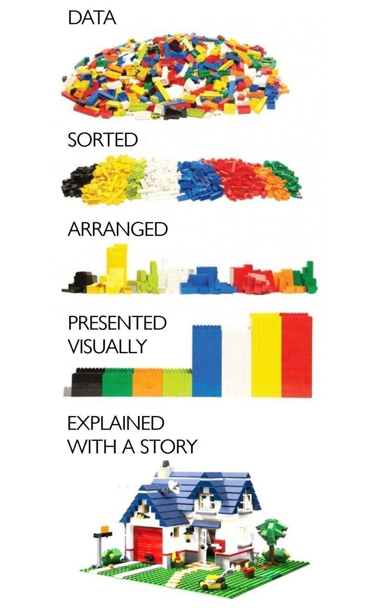

# It's all about data
Up until now, everything in this book has been about what we can do with technology. But, fundamentally, it all comes down to data: 

* What's the first thing we do after setting up a landing zone in the cloud? We think about how to improve our use of data.
* What's underpinning all of the artificial intelligence that some think is the next big opportunity? Data. Lots of it.
* What's needed for us to make a difference in sustainability? Data.

It's long since been recognised that data comes in various forms - sructured and unstructured. And that there's a difference between data, information, knowledge and wisdom. People have built entire careers around "Knowledge Management". One data visualisation that I saw really struck home though...

I don't know the source (a reverse image search turned up some posts on Reddit from 2021 and an earlier version of the graphic from 2015 without the storytelling part, but nothing conclusive). Regardless, I like the message. 

Data on its own is a pile of bits (literally, ones and zeros). 

We can organise those bits by attributes, in this case colour, to help us work more effectively with the data. 

We can arrange them to understand something about the data - this is the analysis part - for example how many bricks are there of each colour? 

And we can visualise the outcome from that analysis. 

But what does it actually mean? Only when we use a story to illustrate the value of the data does it really come to life!

[Go home](README.md)
